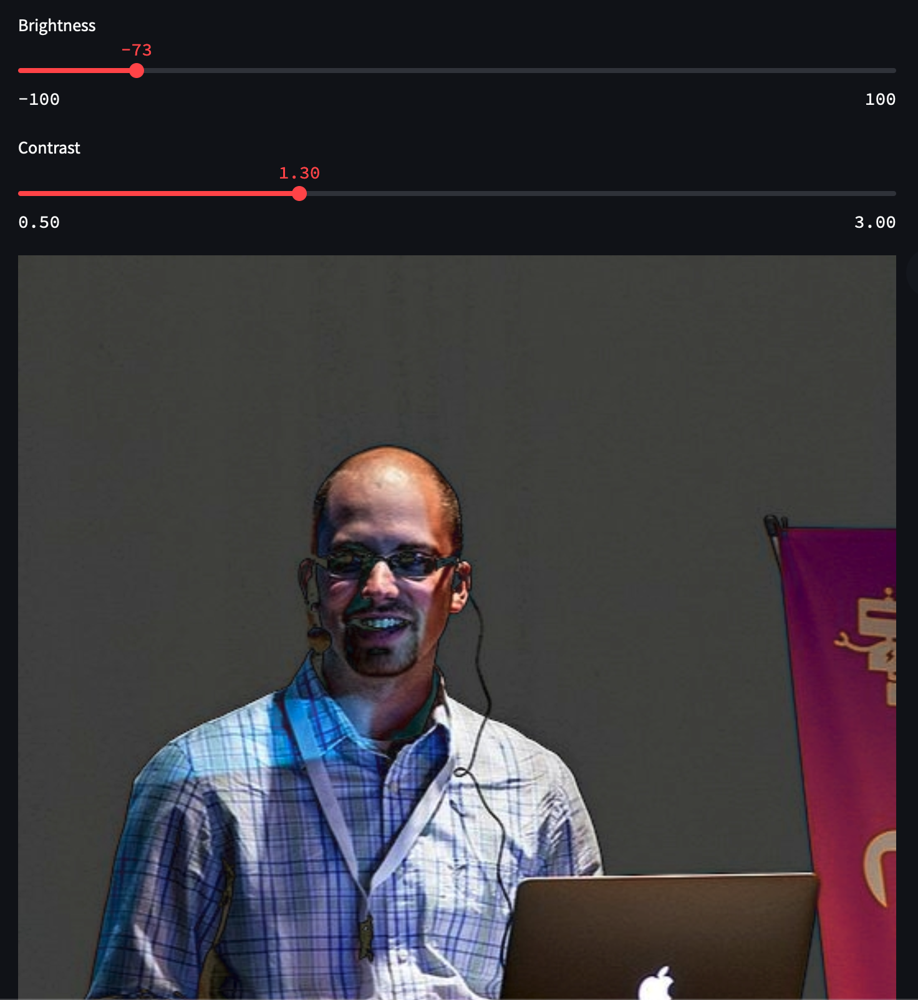
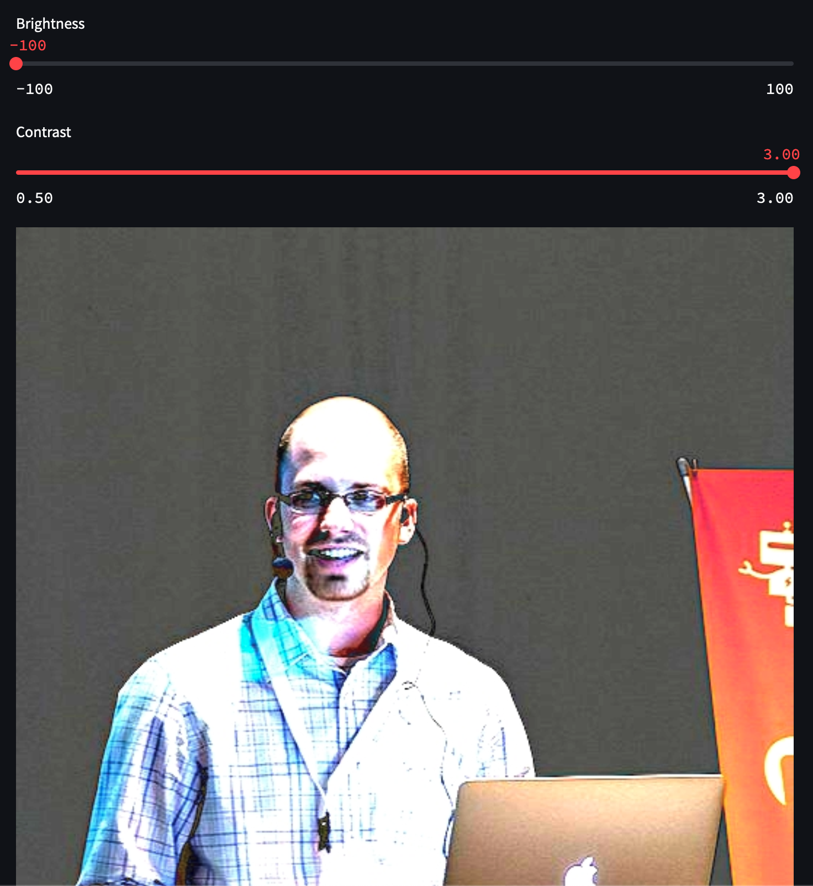

# **Computer Vision with OpenCV**

This project demonstrates how to apply **brightness** and **contrast** adjustments on images using **OpenCV** and **Streamlit**. Users can upload their images directly via the web interface and interactively tweak the brightness and contrast settings to see the effects in real time. The application showcases the power of **Computer Vision** with simple yet effective techniques.

## 🚀 **Live Demo**

You can experience the live demo of the project hosted on Hugging Face Spaces:  
[**Computer Vision with OpenCV - Hugging Face Demo**](https://huggingface.co/spaces/zafermbilen/computer-vision)

## 📝 **Features**

- 📤 **Upload any image** in `.jpg`, `.jpeg`, or `.png` formats.
- 🌞 **Adjust brightness** from -100 to 100.
- 🎨 **Adjust contrast** from 0.5 to 3.0.
- 📸 **Real-time preview** of the original and modified images.
- 🚀 Simple and intuitive interface built with **Streamlit**.

## 📚 **Technologies Used**

- **OpenCV**: For image processing and transformations.
- **Streamlit**: To create the user-friendly web application.
- **Python**: The core programming language used in the project.

## 📸 **Screenshots**

|  |  |
